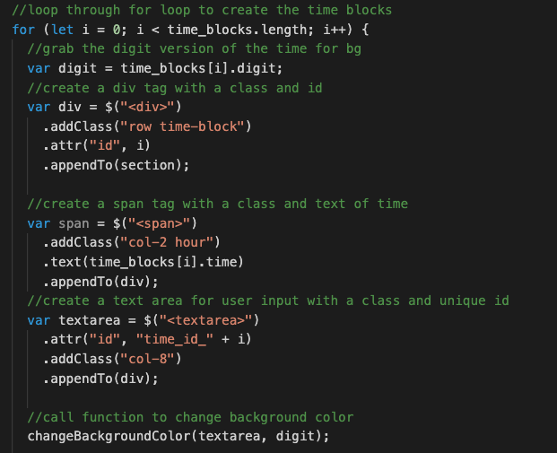

# Kavya's Work Day Scheduler

## Javascript - Module 5 Challenge

## Table of Contents

- [Description](#description)
- [Technologies](#technologies)
- [Deployed Link](#link)
- [Usage](#usage)
- [User Information](#userinformation)
- [Credits](#credits)
- [License](#license)

## Description

A work day schedule where the data persists and the user can save anything they would like within each work hour time block. As long as you save through the button whenever a change is made, your data should be saved! Have fun managing your work day!

## Technologies

- HTML
- CSS
- Bootstrap
- jQuery

## Deployed Link

[Deployed Link](https://smandla.github.io/work_day_scheduler/)

## Usage

### Website Demo

### Code Snippet

#### Code snippet for the time block creation iteration using jQuery to create tag, add classes, and add some styling based on the block we're currently creating.

## User Information

[LinkedIn](https://www.linkedin.com/in/srikavya-mandla/) |
[Portfolio](https://smandla.github.io/kavya_professionalportfolio/)

## Credits

Credits to University of California, Berkeley.

## License

---

© 2022 Trilogy Education Services, LLC, a 2U, Inc. brand. Confidential and Proprietary. All Rights Reserved.
