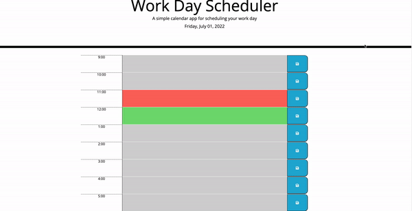

# Kavya's Work Day Scheduler

## Javascript - Module 5 Challenge

## Table of Contents

- [Description](#description)
- [Technologies](#technologies)
- [Deployed Link](#link)
- [Usage](#usage)
- [User Information](#userinformation)
- [Credits](#credits)
- [License](#license)

## Description

```md
GIVEN I am using a daily planner to create a schedule
WHEN I open the planner
THEN the current day is displayed at the top of the calendar
WHEN I scroll down
THEN I am presented with timeblocks for standard business hours
WHEN I view the timeblocks for that day
THEN each timeblock is color coded to indicate whether it is in the past, present, or future
WHEN I click into a timeblock
THEN I can enter an event
WHEN I click the save button for that timeblock
THEN the text for that event is saved in local storage
WHEN I refresh the page
THEN the saved events persist
```

## Technologies

- HTML
- CSS
- JavaScript

## Deployed Link

[Deployed Link](https://smandla.github.io/javascript_timedquiz/)

## Usage

### Website Demo



### Code Snippet


#### Function displays question based on certain variables and updates the look of the UI. For loop that creates buttons for each option.

## User Information

[LinkedIn](https://www.linkedin.com/in/srikavya-mandla/) |
[Portfolio](https://smandla.github.io/kavya_professionalportfolio/)

## Credits

Credits to University of California, Berkeley.

## License

[](https://opensource.org/licenses/MIT)

---

© 2022 Trilogy Education Services, LLC, a 2U, Inc. brand. Confidential and Proprietary. All Rights Reserved.
